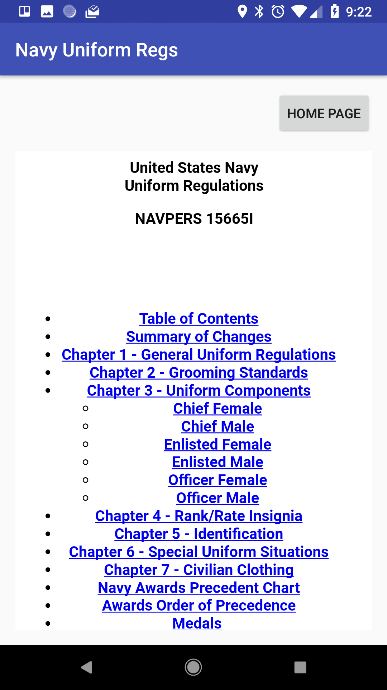

# README

This is the shell of an Android app that takes the Navy uniform regulations, as
published at the Navy Personnel Command website, and integrates them with a
very basic Android WebView.

# LICENSE

I've chosen the BSD license for my work.  Some of the files are auto-generated
by the Android Studio toolchain, and to the extent that license applies to
these at all, BSD for those too.  See the COPYING file.

Although I do not embed them in this source distribution, the U.S. Navy uniform
regulations themselves are not under copyright and are cleared for public
release.

# Dependencies

## To run

- Android 4.0 (API level 16 or better, though even that is probably not the
actual requirement)
- JDK 1.8

## To build

- Gradle (I think?)
- Android Studio 3 (what I used, and should include Gradle already, but maybe
  you know better if you're already familiar with Android)
- wget
- Perl 5.18 or better
- Mojolicious (web framework for Perl)

I use Perl and Mojolicious as built from perlbrew and CPAN-minus, but if your
distribution or OS comes with the right versions then those should work too.

# How to Build

This is how I did it:

1. Prepare the mobile-ready HTML and images (which are not included with this
   source distribution).
    1. Spider the HTML and images from the NPC website (using
        `scripts/spider-script.sh`)
    2. Change to the public.navy.mil/bupers-npc/support/uniforms folder.  Copy
        the entire uniformregulations folder (including all contents) to
        compiled-regs, which should be a sibling of uniformregulations.  This
        is mostly to capture the images, which are a mishmash of .jpg, .JPG,
        .gif, and a stray .png.  The HTML files will be overwritten.
    3. Change to the uniformregulations folder.
    4. Use the `scripts/build-script.sh` script, which itself relies on the
        aptly-named `scripts/read-file.pl` Perl script, to generate the
        prepped HTML in the ../compiled-regs folder.
    5. Copy the compiled-regs folder (including all contents) to the
        app/src/main/assets folder.  You might want to wait to do this until
        after you've loaded up the project in Android Studio.
2. Import this ZIP file contents as a project in Android Studio.

But, you probably just want to run the `scripts/prepare-for-build.sh` script
which should more or less mirror those steps.

Note that I'm not a Java wizard, the last time I did anything appreciable in
Java, the `ant` tool still had the new car smell.  So while I've tried to
avoid over-importing my local project settings into this ZIP file, I may have
left too much.  Android Studio worked very well for me though so I'm sure it
can figure this out too, however you manage to import this as a project.

Once you've done 1) and 2) you should be able to build the Gradle project in
Android Studio and generate an APK that contains the Navy regs in a reasonably
easy-to-browse fashion.

They're still Navy regs, this won't make them any shinier, but it demonstrates
the concept.

# Why on Earth?...

So, I may or may not have told a smattering of Navy Captains that making the
most basic of apps containing the Navy uniform regs could be done as a weekend
project.

Turns out that to their credit, no one wanted to push a "garage project" app
on Navy sailors, but all the same I wanted to see if I could do it.

As it turns out, I could.

    Michael Pyne <michael.pyne@gmail.com>
